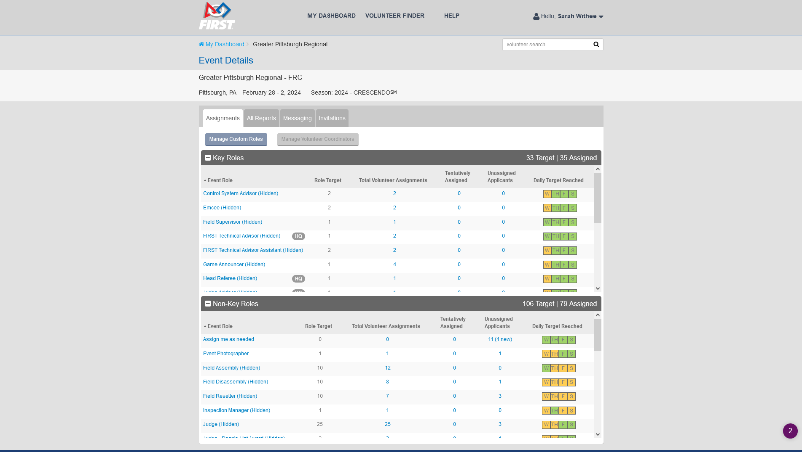
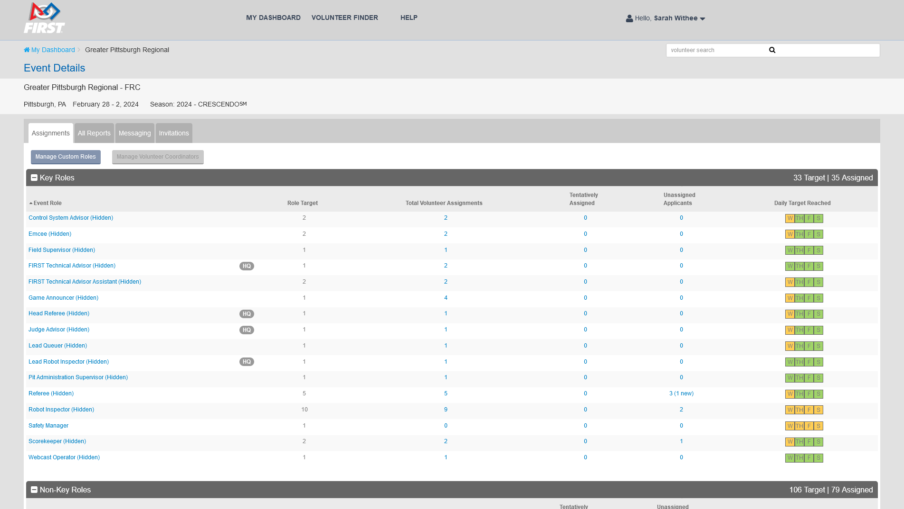

# Better VMS

_An attempt to make a browser plugin that makes FIRST Robotics' Volunteer Management System (VMS) more pleasant to work with!_

## What is this?

[FIRST Robotics](https://firstinspires.org) is a program for students to experience the engineering process to build robots and take them to competitions.

As a volunteer coordinator for a high school competition event, the volunteer management system they provide is old, outdated, and a pain to use. I had an idea of making a browser plugin that does some basic rewrites to the pages of the app to make it easier to work with.

## Screenshots

**Before:**

**After:**

